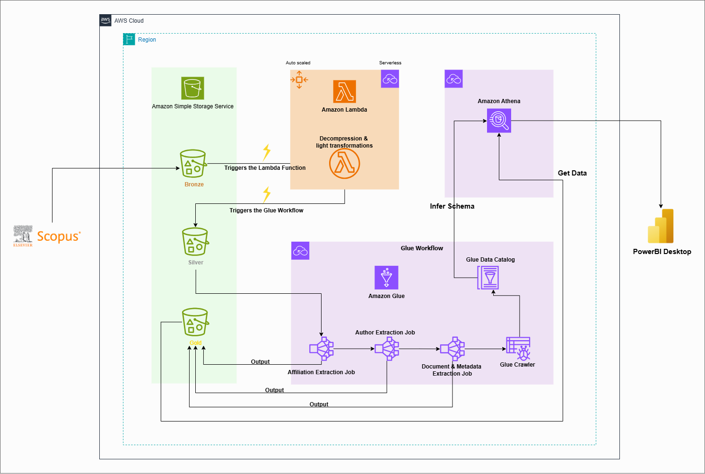

## ANALYSIS OF SCIENTIFIC RESEARCH ARTICLES IN MOROCCO ON AWS
🚀 Automation of Scientific Analysis with a Data Pipeline on AWS
### 1️⃣ INTRODUCTION
The project "Analysis of Scientific Research Articles in Morocco on AWS Cloud" is an innovative initiative aimed at automating the analysis of Moroccan scientific publications indexed on Scopus.

By using a robust data pipeline deployed on AWS, this project enables:

● 🔍 Exploring collaboration networks between Moroccan and international authors.

● 🌍 Identifying the most used languages in scientific publications.

● 📈 Detecting thematic trends and the most active research areas.

● 🎯 Providing actionable insights for researchers, institutions, and policymakers.

### 2️⃣ WHY IS THIS PROJECT COOL?
● **Innovation:** Use of AWS cloud to automate large-scale scientific data analysis.

● **Impact:** Contribution to understanding the scientific research ecosystem in Morocco.

● **Scalability:** Modular design allowing the extension of the analysis to other countries or platforms.

● **Visualization:** Interactive dashboards for intuitive data exploration.

### 3️⃣ DATA

The data comes from the Scopus platform, which catalogs and indexes scientific articles published worldwide from 1913 until now.

The data file exported from Scopus contains the following attributes:
• **Authors** (The abbreviated names of the authors contributing to the article, e.g., "Nadif B.")  
• **Author full names** (The full names of the authors contributing to the article with their IDs, e.g., "Nadif, Bendaoud (59482605100)")  
• **Author(s) ID** (The IDs of the authors, e.g., "59482605100)  
• **Title** (The title of the article, e.g., "Unveiling the relationships between language learning strategies and academic achievement among Moroccan EFL university students")  
• **Year** (The year of publication of the article, e.g., "2025")  
• **Source title** (The title of the source responsible for publishing the article, e.g., "Journal of Interdisciplinary Studies in Education")  
• **Volume** (The number of pages in the article, e.g., "14")  
• **Issue** (The issue number in which the article is published, e.g., "1")  
• **Art. No.** (The article number in the source, e.g., "2")  
• **Page start** (The first page publishing the article, e.g., "20")  
• **Page end** (The last page publishing the article, e.g., "37")  
• **Page count** (The number of pages containing the article, e.g., "17")  
• **Cited by** (The number of citations, e.g., "0")  
• **DOI** (Digital Object Identifier for the article, e.g., "10.32674/4b63m946")  
• **Link** (The link to access the article, e.g., "https://www.scopus.com/inward/record.uri?eid=2-s2.0-85212778437&doi=10.32674%2f4b63m946&partnerID=40&md5=a81e54e194a11fc2c717775f9ea56e5b")  
• **Affiliations** (The affiliations of the article, e.g., "Superior School of Education and formation, Sultan Moulay Slimane University, Beni Mellal, Morocco")  
• **Authors with affiliations** (The affiliations with the affiliated authors, e.g., "Nadif B., Superior School of Education and formation, Sultan Moulay Slimane University, Beni Mellal, Morocco")  
• **Abstract** (The abstract of the article, e.g., "This paper aims to ...")  
• **Author Keywords** (e.g., "Academic achievement; autonomy; gender; language learning strategies; self-regulated learning")  
• **Index Keywords** (The index keywords)  
• **Molecular Sequence Numbers** ()  
• **Chemicals/CAS** (The list of chemicals mentioned in the article)  
• **Tradenames** (The trade names of the products or chemical substances mentioned in the article)  
• **Manufacturers** (The manufacturers or suppliers of the chemical products, equipment, or materials mentioned in the article)  
• **Funding Details** (The information on the funding sources of the research)  
• **Funding Texts** (The textual descriptions of the funding details)  
• **References** (The list of bibliographic references cited in the article)  
• **Correspondence Address** (The address of the corresponding author)  
• **Editors** (The editors responsible for publishing the article)  
• **Publisher** (The publishing house or organization that published the article)  
• **Sponsors** (The organizations or institutions that sponsored the research or publication)  
• **Conference name** (The name of the conference where the article was presented)  
• **Conference date** (The date the conference took place)  
• **Conference location** (The location where the conference was held)  
• **Conference code** (A unique code identifying the conference)  
• **ISSN** (The International Standard Serial Number (ISSN))  
• **ISBN** (The International Standard Book Number (ISBN))  
• **CODEN** (An alphanumeric code used to identify scientific publications)  
• **PubMed ID** (The unique identifier of the article in the PubMed database)  
• **Language** of Original Document (The language in which the article was originally published)  
• **Abbreviated Source Title** (The abbreviated title of the journal or source in which the article was published)  
• **Document Type** (The type of document, e.g., research article, literature review, letter, etc.)  
• **Publication Stage** (The publication stage, e.g., In progress)  
• **Open Access** (Indicates whether the article is open access or not)  
• **Source** (The source of the article, e.g., scopus)  
• **EID** (The Elsevier Identifier (EID), a unique identifier assigned to each document in Scopus, generally with a unique syntax: "2-s2.0-" + "85212778437")  

### 4️⃣ PROJECT ARCHITECTURE

My data pipeline is designed to be scalable, secure, and efficient. Here is an overview of the architecture:

### 5️⃣ KEY COMPONENTS

● 📥 Data Collection: Extraction of data from Scopus via exports.

● 💾 Storage: Use of Amazon S3 for storing raw and processed data.

● ⚙️ Processing: Data transformation with AWS Glue and Lambda.

● 📊 Analysis: Use of Amazon Athena for data cataloging.

● 📈 Visualization: Creation of interactive dashboards with Power BI desktop in Direct Query mode.

● 🧩 Orchestration: Workflow management with AWS Glue Workflows.

### 6️⃣ STACK USED

● ☁️ Cloud : AWS (S3, Glue, Lambda, Athena)

● 💻 Languages: Python, SQL, and Spark

● 🛠️ Tools: Terraform (IaC) & PowerBI Desktop.

### 7️⃣ HOW TO USE THIS PROJECT?

⚠️Prerequisites  
● An AWS account  
● Terraform 1.0 and above  
● Visual Studio Code  
● A Scopus account to extract data  

**1. Clone the repository:**
`git clone https://github.com/votre-utilisateur/votre-projet.git`

**2. Configure the AWS account in AWS CLI (Access Key):**
`aws configure`

**3. Launch Terraform to create the cloud infrastructure:**

● `terraform init` to initialize Terraform.   
● `terraform plan plan.tfplan` to create the Terraform plan.   
● `terraform apply plan.tfplan` to apply the Terraform plan.   

**4. Connect AWS Athena with Power BI Desktop via an ODBC:**  
Configure ODBC to connect to AWS Athena via Power BI in Direct Query mode (See [AWS Documentation](https://docs.aws.amazon.com/athena/latest/ug/odbc-v2-driver.html))

**5. Visualize the dashboard:**  

  
  
  

  

